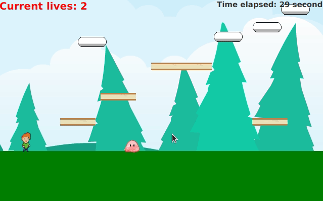

# Preface
This was one of my second-year projects. A little bit less glamorous than my rose-tinted glasses would have me believe, it nonetheless showcases how far I've come as a programmer.
Presented in this repository is a simple Java-made Mario clone. It features a basic level creator (in the form of JSON file configurations), support for multiple levels, a save/load system, and ability to provide various enemy AIs. 

# Demonstration

# Compiling and running
The program can be built using *gradle build*. It can then be run using *gradle run*.

# Acknowledgements
Some assets were kindly provided by Kenney at https://www.kenney.nl/assets.